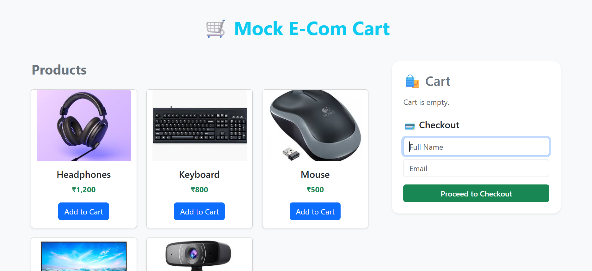
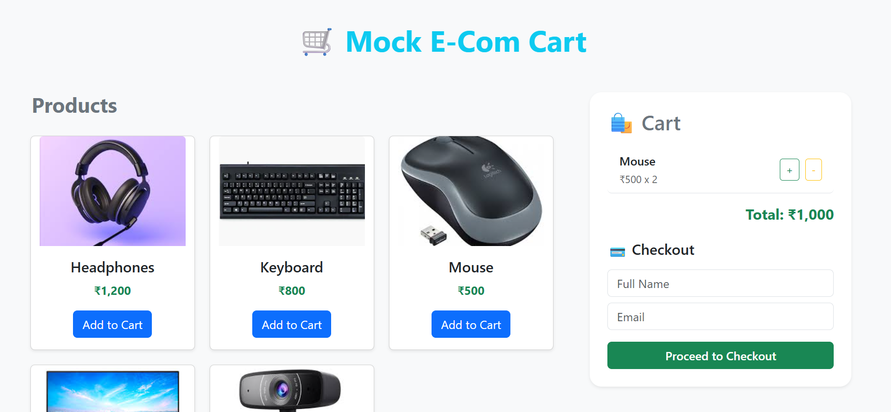
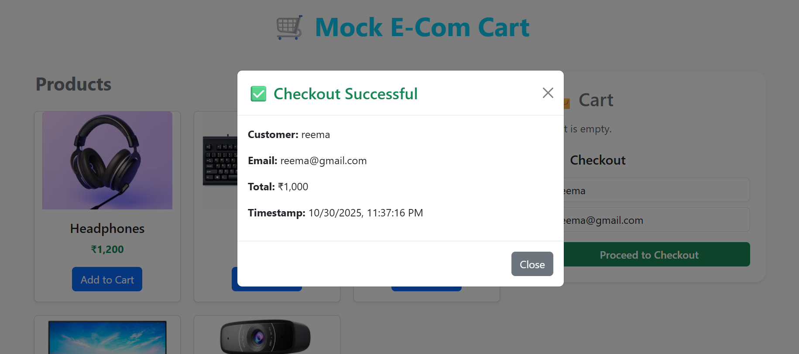

# 🛒 Mock E-Com Cart

A full-stack shopping cart web app built as part of the **Vibe Commerce Full Stack Coding Assignment**.

---

## 📦 Tech Stack
- **Frontend:** React + Bootstrap
- **Backend:** Node.js + Express.js
- **Database:** (In-memory / JSON mock)
- **API Type:** REST API

---

## 🚀 Features
✅ View product list  
✅ Add / Remove items to cart  
✅ Display total price in ₹  
✅ Mock checkout (name, email, timestamp, total)  
✅ Responsive layout using Bootstrap  

---

## ⚙️ Backend API Endpoints

| Method | Endpoint | Description |
|--------|-----------|-------------|
| GET | `/api/products` | Get list of mock products |
| GET | `/api/cart` | Get current cart + total |
| POST | `/api/cart` | Add item `{ productId, qty }` |
| DELETE | `/api/cart/:id` | Remove item by ID |
| POST | `/api/checkout` | Process mock checkout |

---

## 🧩 Folder Structure
mock-ecom-cart/
│
├── backend/
│ └── server.js
│
├── frontend/
│ ├── src/
│ └── public/
│
└── README.md

---

## 🧠 How to Run Locally
### Backend
```bash
cd backend
npm install
node server.js


Frontend

cd frontend
npm install
npm start


## 📸 Screenshots

### 🏠 Home Page


### 🛒 Cart Page


### ✅ Checkout Page

